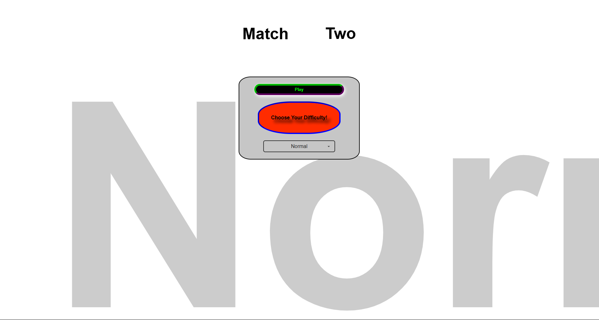

# 🚀 Project Title: Match Two - Memory Game

A sleek and interactive memory game where users flip cards to match pairs. Built with HTML, CSS (3D transforms, Grid), and vanilla JavaScript. Includes DOM manipulation, animations, spam protection, and a polished responsive layout.

---

## 🖼️ Live Demo

🔗 [Play the game now](https://44RY4N.github.io/project-match-two/)

---

## 📸 Preview

 <!-- Replace with actual path -->

---

## 🛠️ Tech Stack

- **HTML5**: Semantic structure
- **CSS3**: 3D animations, responsive design, Grid Layout
- **JavaScript (ES6+)**: Game logic, DOM manipulation, click spam protection
- **No frameworks**: Pure vanilla magic ✨

---

## 🔍 Features

- 🎮 Click-to-flip memory cards
- 🧠 Match two logic with feedback animations
- 🔐 Board locking during animations to prevent spam
- ✨ CSS Grid layout for card positioning
- 💫 Smooth transitions and effects
- 📱 Fully responsive design

---

## 🚧 How It Works

1. On load, cards are shuffled and hidden.
2. Click to flip a card — flip a second to check for match.
3. Matching cards stay flipped, others flip back.
4. Game ends when all pairs are matched.

---

## 📦 Project Structure

project-match-two/                                                                  
├── index.html                                                                      
├── style.css                                                                  
├── script.js                                                                      
├── logo/                                                                            
└── README.md                                                                              

---

## 📈 Lessons Learned

- Used **CSS Grid** for complex layouting
- Handled **DOM manipulation** efficiently
- Built a clean **user experience** with UI feedback
- Practiced clean code and scalability

---

## ✨ Future Improvements

- 🎵 Add sound effects
- 🔢 Track number of attempts and time
- 🌗 Add dark/light mode
- 💾 Local storage for high scores

---

## 🤝 Acknowledgments

Thanks to The Odin Project for structure and guidance!

---

## 📬 Contact

Made with ❤️ by [44RY4N](https://github.com/44RY4N)  
Feel free to fork, star ⭐, and connect!

# project-match-two

The following project uses HTML,CSS and js to implement the game Match Two

---(its a famous game and this was a personal project, I had to practice grid and I wanted to make something interactive where I could learn as many features as I could)

- Implemented using simple JS DOM manipulation please refer to my script.js file
- CSS involved uses keyframes to simulate animations for the home menu
- HTML is kept very basic for efficiency
- Added features like difficulty selection and spam protection to maintain the integrity
- Also added delays wherever required for better UX
